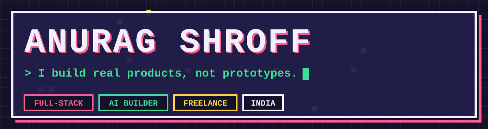
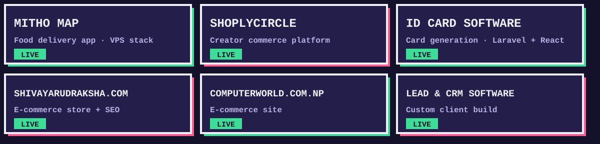
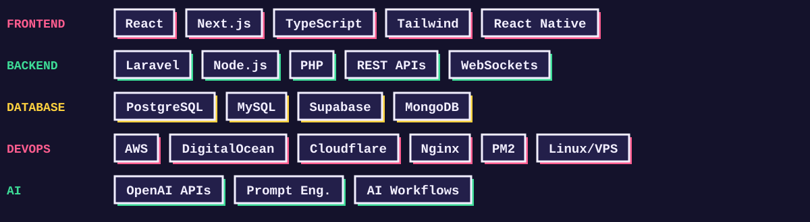

<div align="center">



<br/>

[](https://visitcount.itsvg.in)
&nbsp;
[](mailto:devanuragshroff@gmail.com)
&nbsp;
[](https://www.linkedin.com/in/anurag-shroff-8b571b2ab/)
&nbsp;
[](https://x.com/AnuragShro39763)

</div>


## `🎮 PLAYER CARD`

```
╔══════════════════════════════════════════════════════════════════╗
║  PLAYER   :  Anurag Shroff                                       ║
║  CLASS    :  Full-Stack Architect  ✦  AI Builder                 ║
║  REGION   :  India 🇮🇳                                           ║
║  MODE     :  Freelance · Hardcore                                 ║
╠══════════════════════════════════════════════════════════════════╣
║  HP  ████████████████████  100 / 100   [ NEVER GIVES UP ]        ║
║  XP  ███████████████░░░░░   5,420 / 7,000  → LVL 9 SOON         ║
╠══════════════════════════════════════════════════════════════════╣
║  ⚡  PASSIVE  :  Ships before others finish planning              ║
║  🔥  SPECIAL  :  Turns ideas into deployed products               ║
║  🧠  TRAIT    :  Obsessed with architecture & automation          ║
╚══════════════════════════════════════════════════════════════════╝
```


## `⚔️ SKILL TREE`

```
  FRONTEND          LVL 9  ████████████████████  ██░  95%
  BACKEND           LVL 9  ███████████████████░  ░░░  92%
  DATABASE          LVL 8  ████████████████░░░░  ░░░  82%
  DEVOPS            LVL 8  ███████████████░░░░░  ░░░  78%
  AI INTEGRATION    LVL 7  █████████████░░░░░░░  ░░░  68%
  SYSTEM DESIGN     LVL 9  ████████████████████  ██░  96%
  SPEED SHIPPING    LVL MAX ████████████████████  ███  🔥
```


## `🗺️ ACTIVE QUESTS`

<table>
<tr>
<td width="50%">

```
[ QUEST ]  ☁️ DeployIQ
[ TYPE  ]  Main Quest  🟡
[ DESC  ]  Railway-style PaaS for
           deploying & managing apps
[ XP    ]  +2500 on completion
[ PROG  ]  ████████░░  80%
```

</td>
<td width="50%">

```
[ QUEST ]  💬 ChatFlow
[ TYPE  ]  Main Quest  🟡
[ DESC  ]  WhatsApp CRM SaaS
           Next.js · Drizzle · Stripe
[ XP    ]  +2000 on completion
[ PROG  ]  ██████░░░░  60%
```

</td>
</tr>
<tr>
<td>

```
[ QUEST ]  🖥️ CorePanel
[ TYPE  ]  Side Quest  🔵
[ DESC  ]  Self-hosted control panel
           cPanel/hPanel alternative
[ XP    ]  +1500 on completion
[ PROG  ]  █████░░░░░  50%
```

</td>
<td>

```
[ QUEST ]  🔥 AI Dev Tools Suite
[ TYPE  ]  Side Quest  🔵
[ DESC  ]  Automating dev workflows
           with AI-powered tooling
[ XP    ]  +1800 on completion
[ PROG  ]  ███░░░░░░░  35%
```

</td>
</tr>
<tr>
<td>

```
[ QUEST ]  🗣️ VocoNet
[ TYPE  ]  Side Quest  🔵
[ DESC  ]  Real-time voice translation
           WebSockets + AI pipeline
[ XP    ]  +1200 on completion
[ PROG  ]  ███████░░░  70%
```

</td>
<td>

```
[ QUEST ]  🤖 AI Portfolio Generator
[ TYPE  ]  Side Quest  🔵
[ DESC  ]  Dev profiling + scoring
           Auto-generated portfolios
[ XP    ]  +1000 on completion
[ PROG  ]  ████░░░░░░  40%
```

</td>
</tr>
</table>


## `🏆 ACHIEVEMENTS UNLOCKED`

<div align="center">

| Badge | Achievement | Rarity |
|:---:|:---|:---:|
| 🏅 | **`SHIPPED_IN_PROD`** — Deployed 6+ live products used by real users | `RARE` |
| 🥇 | **`FULL_STACK_MASTER`** — Proficient across the entire web stack | `EPIC` |
| 🤖 | **`AI_WHISPERER`** — Integrated AI into production workflows | `RARE` |
| ⚡ | **`ZERO_TO_DEPLOY`** — Took projects from 0 to live solo | `EPIC` |
| 🌐 | **`MULTI_DOMAIN`** — Shipped in SaaS, CRM, maps, e-comm & more | `LEGENDARY` |
| 🔧 | **`DEVOPS_SELF_TAUGHT`** — Manages VPS, Nginx, Cloudflare, PM2 solo | `RARE` |
| 🌏 | **`GLOBAL_CLIENTS`** — Worked with clients across Nepal & India | `UNCOMMON` |

</div>


## `📦 COMPLETED DUNGEONS`



<br/>

<table>
<tr>
<td width="50%">

### 🪪 ID Card Studio
```
DUNGEON  : Print Engine Boss Fight
CLEARED  : ██████████  100%  ✅
LOOT     : CR80 → A4 auto-layout
           Real admin system shipped
RATING   : ★★★★★
```

</td>
<td width="50%">

### 🗣️ VocoNet v1
```
DUNGEON  : Real-time Translation Arc
CLEARED  : ██████████  100%  ✅
LOOT     : WebSocket + AI pipeline
           Live cross-language comms
RATING   : ★★★★☆
```

</td>
</tr>
<tr>
<td>

### 📊 Log Monitor System
```
DUNGEON  : Observability Raid
CLEARED  : ██████████  100%  ✅
LOOT     : Centralized multi-project
           monitoring dashboard
RATING   : ★★★★☆
```

</td>
<td>

### � ShoplyCircle
```
DUNGEON  : E-Commerce Full Build
CLEARED  : ██████████  100%  ✅
LOOT     : Full commerce platform
           Live & serving users
RATING   : ★★★★★
```

</td>
</tr>
</table>


## `⚙️ EQUIPPED GEAR`




## `📊 STATS DASHBOARD`

<div align="center">


</div>


## `📡 PARTY INVITE OPEN`

```
╔══════════════════════════════════════════════════════════╗
║  ⚔️  LOOKING FOR GROUP                                   ║
╠══════════════════════════════════════════════════════════╣
║                                                           ║
║  [ ROLE NEEDED ]  Serious builder with a real problem     ║
║                                                           ║
║  ✅  Collabs · Freelance · Product Co-building            ║
║  ✅  Full-stack builds from 0 → deployed in prod          ║
║  ✅  AI integration · Dev tooling · SaaS architecture     ║
║                                                           ║
║  📩  devanuragshroff@gmail.com                           ║
║  🔗  linkedin.com/in/anurag-shroff-8b571b2ab             ║
║  🐦  x.com/AnuragShro39763                              ║
║                                                           ║
║  [ WARNING ]  Only serious quests. No tutorials.          ║
╚══════════════════════════════════════════════════════════╝
```


<div align="center">

```
██████╗ ██╗   ██╗██╗██╗     ██████╗     ███████╗ █████╗ ███████╗████████╗
██╔══██╗██║   ██║██║██║     ██╔══██╗    ██╔════╝██╔══██╗██╔════╝╚══██╔══╝
██████╔╝██║   ██║██║██║     ██║  ██║    █████╗  ███████║███████╗   ██║   
██╔══██╗██║   ██║██║██║     ██║  ██║    ██╔══╝  ██╔══██║╚════██║   ██║   
██████╔╝╚██████╔╝██║███████╗██████╔╝    ██║     ██║  ██║███████║   ██║   
╚═════╝  ╚═════╝ ╚═╝╚══════╝╚═════╝     ╚═╝     ╚═╝  ╚═╝╚══════╝   ╚═╝  

          ⚡  BUILD FAST  ·  SHIP SMART  ·  SCALE HARD  ⚡
              [ CURRENT STATUS :  GRINDING  🎮 ]
```

</div>
